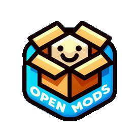

# NeoModLoader

Provide a new mod loader for [Worldbox](http://www.superworldbox.com/) after [NCMS](https://denq04.github.io/ncms/).

## Features of mod loading

1. Search mod.json and load mod under GAMEPATH/Mods
2. Simple dependency management for mods (some boundary conditions are not handled, circular dependency is not handled)
3. Cache of mod compilation results
4. Support for NCMS mods (nearly all)
5. Recognize BepInEx mods loaded (You need to install BepInEx manually)
6. Upload mods to and Order mods from Steam Workshop (still in experimental testing phase)

## Recent plans
1. Complete Steam Workshop mod upload authentication
2. Mod Loader auto-update based on Steam Workshop
3. Load compiled mods under Mods folder directly according to mod.json
4. Load mods in zip and other compressed packages

## How to install
1. Download NeoModLoader.dll (and NeoModLoader.pdb) and put it in GAMEPATH/worldbox_Data/StreamingAssets/mods folder
2. Delete NCMS_memload.dll
3. Start the game with experimental mode enabled